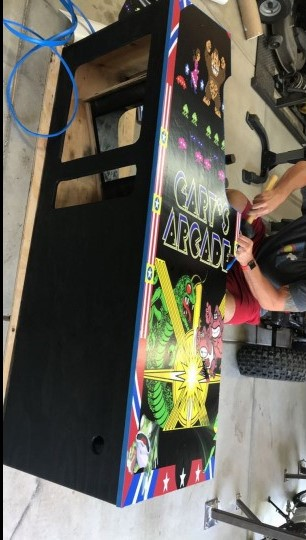
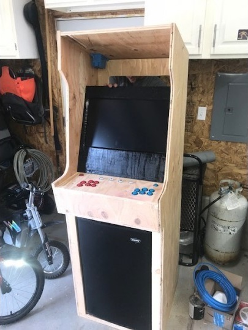

After my senior year of high school, I came up with the idea to build an arcade machine. At first, I just wanted one. I wanted to own an arcade machine cause I always wanted to play it whenever I would like. After doing some research and realizing the cost of buying an arcade machine is really high, I decided I could build one myself with a Raspberry Pi.

I came to my father's friend with the idea of building this thing and he was down to help me out. With his woodworking experience, we were able to make an arcade machine from scratch.

Total cost: ~$800
Total man-hours: 30

Also, we designed it to fit a minifridge in the bottom so I could put it in my dorm.

