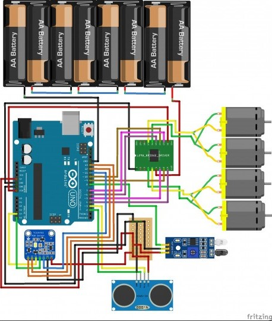
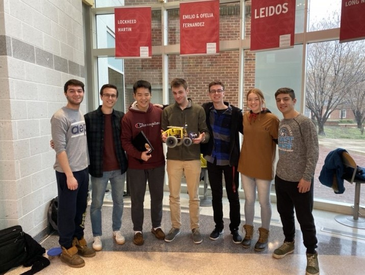

Our mission was to plan and build an autonomous robot to complete specific mission requirements. To successfully complete the mission, our Over-Sand Vehicle (OSV) had to clear rocky terrain, navigate around obstacles to reach a black box locator beacon, touch the beacon with the OSV, place an Aruco marker on/near the beacon, and correctly measure and transmit the color of LED light lit up on the beacon. The total cost of the OSV had to be kept under $320 and the mission needed to be completed in under five minutes. The OSV also had to be held to specific safety standards and stay within dimensional constraints.

Our OSV structure is composed of wood for the body, four wheels, four motors, a combination of three different types of sensors, and a communication chip paired with a tracking marker. The body of the OSV is a square-shaped wood piece that holds all of the electronics on top and has the motors mounted on the belly.

In order to complete our mission, we utilized our sensors to navigate the OSV autonomously around obstacles and to the mission site. With the use of the communication chip on our OSV we were able to see where we are on the ground at all times, which helped our OSV navigate. When at the mission site, our OSV is designed to push a marker off the top of itself, transmit the color of LED alight on the beacon, then successfully push the tracking marker on the ground right next to the beacon.

<object data="https://www.itsecgary.com/projects/20210421_osvmission/osv3.pdf" type="application/pdf" width="700px" height="700px">
    <embed src="osv3.pdf">
        
This browser does not support PDFs. Please download the PDF to view it: <a href="osv3.pdf">Download PDF</a>.

    </embed>
</object>
